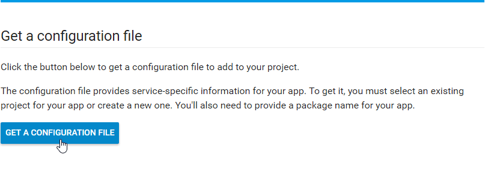
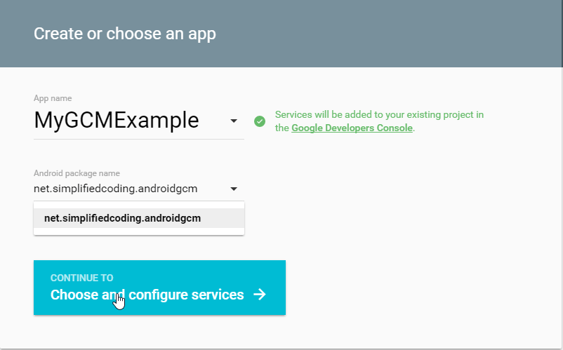
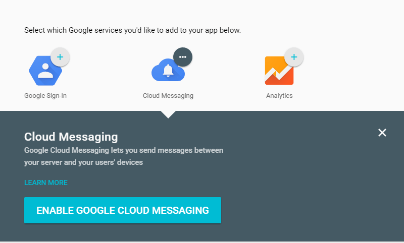
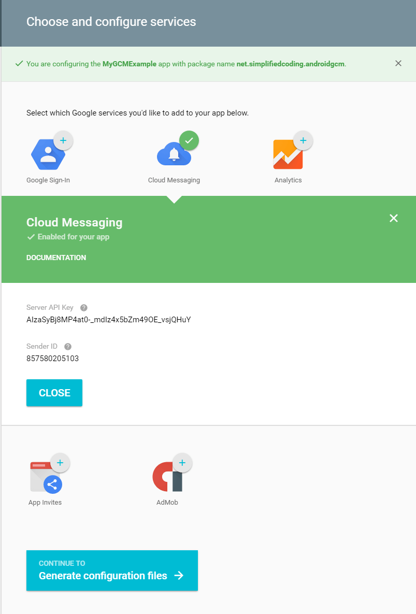

#### What is GCM?

For peoples who don’t know what is GCM? GCM stands for google cloud messaging. It is a service given by google that helps us to send both downstream and upstream messages between mobile and server. GCM is free to use and you can also create real time chat applications using GCM.

#### Android Push Notification using GCM

In this post we will not be creating a chat application. We will only create a simple example of integrating push notification using google cloud messaging. 

#### Creating an Android Studio Project

Again we need to create a new Android Studio Project. So open Android Studio and create a new project. I have created AndroidGCM.

#### Creating an App in Google Developers

In this step we need to get google-services.json file. This file contains the configuration specific to your application.
Go to this link. And click on GET A CONFIGURATION FILE (See the image below).

Now you will be asked to enter an app name, and your application’s package name. Just put an app name (I have written MyGCMExample) and the package name of the project your created. We copied the package name after creating project from the manifest so you only need to paste it here (see the image below) and click on Continue To Choose and Configuration Service.

Now in the next screen you will see a button to enable google cloud messaging, click on that.

After clicking on Enable Google Cloud Messaging you will get Server API Key and Sender Id. Copy it and save it on a text file it will be used.

Now Scroll below and click on Continue To Generate Configuration Files.

Now you will get a button to download the configuration file. Click on the button and you will get your goolge-services.json file.

Come inside your app level build.gradle file and add the following lines

         dependencies {
			compile fileTree(include: ['*.jar'], dir: 'libs')
			testCompile 'junit:junit:4.12'
			compile 'com.android.support:appcompat-v7:23.1.1'
		 
			//This line is added
			compile 'com.google.android.gms:play-services-gcm:8.3.0'
		}
		 
		//This line is added
		apply plugin: 'com.google.gms.google-services'

#### Creating  GCMRegistrationIntentService

		package net.pack.androidgcm;

		import android.app.IntentService;
		import android.content.Intent;
		import android.support.v4.content.LocalBroadcastManager;
		import android.util.Log;

		import com.google.android.gms.gcm.GoogleCloudMessaging;
		import com.google.android.gms.iid.InstanceID;

		public class GCMRegistrationIntentService extends IntentService {
			//Constants for success and errors
			public static final String REGISTRATION_SUCCESS = "RegistrationSuccess";
			public static final String REGISTRATION_ERROR = "RegistrationError";

			//Class constructor
			public GCMRegistrationIntentService() {
				super("");
			}

			@Override
			protected void onHandleIntent(Intent intent) {
				//Registering gcm to the device
				registerGCM();
			}

			private void registerGCM() {
				//Registration complete intent initially null
				Intent registrationComplete = null;

				//Register token is also null
				//we will get the token on successfull registration
				String token = null;
				try {
					//Creating an instanceid
					InstanceID instanceID = InstanceID.getInstance(getApplicationContext());

					//Getting the token from the instance id
					token = instanceID.getToken(getString(R.string.gcm_defaultSenderId), GoogleCloudMessaging.INSTANCE_ID_SCOPE, null);

					//Displaying the token in the log so that we can copy it to send push notification
					//You can also extend the app by storing the token in to your server
					Log.w("GCMRegIntentService", "token:" + token);

					//on registration complete creating intent with success
					registrationComplete = new Intent(REGISTRATION_SUCCESS);

					//Putting the token to the intent
					registrationComplete.putExtra("token", token);
				} catch (Exception e) {
					//If any error occurred
					Log.w("GCMRegIntentService", "Registration error");
					registrationComplete = new Intent(REGISTRATION_ERROR);
				}
				
				//Sending the broadcast that registration is completed
				LocalBroadcastManager.getInstance(this).sendBroadcast(registrationComplete);
			}
		}

#### Creating  GCMPushReceiverService

Now we need to create the receiver for our android push notification using gcm. Create a new class named GCMPushReceiverService.java and write the following code.

		 package net.pack.androidgcm;

		import android.app.NotificationManager;
		import android.app.PendingIntent;
		import android.content.Context;
		import android.content.Intent;
		import android.media.RingtoneManager;
		import android.net.Uri;
		import android.os.Bundle;
		import android.support.v4.app.NotificationCompat;

		import com.google.android.gms.gcm.GcmListenerService;

		//Class is extending GcmListenerService 
		public class GCMPushReceiverService extends GcmListenerService {
			
			//This method will be called on every new message received 
			@Override
			public void onMessageReceived(String from, Bundle data) {
				//Getting the message from the bundle 
				String message = data.getString("message");
				//Displaying a notiffication with the message 
				sendNotification(message);
			}
			
			//This method is generating a notification and displaying the notification 
			private void sendNotification(String message) {
				Intent intent = new Intent(this, MainActivity.class);
				intent.addFlags(Intent.FLAG_ACTIVITY_CLEAR_TOP);
				int requestCode = 0;
				PendingIntent pendingIntent = PendingIntent.getActivity(this, requestCode, intent, PendingIntent.FLAG_ONE_SHOT);
				Uri sound = RingtoneManager.getDefaultUri(RingtoneManager.TYPE_NOTIFICATION);
				NotificationCompat.Builder noBuilder = new NotificationCompat.Builder(this)
						.setSmallIcon(R.mipmap.ic_launcher)
						.setContentText(message)
						.setAutoCancel(true)
						.setContentIntent(pendingIntent);

				NotificationManager notificationManager = (NotificationManager)getSystemService(Context.NOTIFICATION_SERVICE);
				notificationManager.notify(0, noBuilder.build()); //0 = ID of notification
			}
		}

#### Coding our MainActivity

Now come to your MainActivity.java and write the following code

			package net.pack.androidgcm;

			import android.support.v7.app.AppCompatActivity;
			import android.os.Bundle;

			import android.app.Activity;
			import android.content.BroadcastReceiver;
			import android.content.Context;
			import android.content.Intent;
			import android.content.IntentFilter;
			import android.os.Bundle;
			import android.support.v4.content.LocalBroadcastManager;
			import android.util.Log;
			import android.widget.Toast;

			import com.google.android.gms.common.ConnectionResult;
			import com.google.android.gms.common.GooglePlayServicesUtil;

			//this is our main activity
			public class MainActivity extends AppCompatActivity {

				//Creating a broadcast receiver for gcm registration
				private BroadcastReceiver mRegistrationBroadcastReceiver;
				@Override
				protected void onCreate(Bundle savedInstanceState) {
					super.onCreate(savedInstanceState);
					setContentView(R.layout.activity_main);

					//Initializing our broadcast receiver
					mRegistrationBroadcastReceiver = new BroadcastReceiver() {

						//When the broadcast received
						//We are sending the broadcast from GCMRegistrationIntentService

						@Override
						public void onReceive(Context context, Intent intent) {
							//If the broadcast has received with success
							//that means device is registered successfully
							if(intent.getAction().equals(GCMRegistrationIntentService.REGISTRATION_SUCCESS)){
								//Getting the registration token from the intent
								String token = intent.getStringExtra("token");
								//Displaying the token as toast
								Toast.makeText(getApplicationContext(), "Registration token:" + token, Toast.LENGTH_LONG).show();

								//if the intent is not with success then displaying error messages
							} else if(intent.getAction().equals(GCMRegistrationIntentService.REGISTRATION_ERROR)){
								Toast.makeText(getApplicationContext(), "GCM registration error!", Toast.LENGTH_LONG).show();
							} else {
								Toast.makeText(getApplicationContext(), "Error occurred", Toast.LENGTH_LONG).show();
							}
						}
					};

					//Checking play service is available or not
					int resultCode = GooglePlayServicesUtil.isGooglePlayServicesAvailable(getApplicationContext());

					//if play service is not available
					if(ConnectionResult.SUCCESS != resultCode) {
						//If play service is supported but not installed
						if(GooglePlayServicesUtil.isUserRecoverableError(resultCode)) {
							//Displaying message that play service is not installed
							Toast.makeText(getApplicationContext(), "Google Play Service is not install/enabled in this device!", Toast.LENGTH_LONG).show();
							GooglePlayServicesUtil.showErrorNotification(resultCode, getApplicationContext());

							//If play service is not supported
							//Displaying an error message
						} else {
							Toast.makeText(getApplicationContext(), "This device does not support for Google Play Service!", Toast.LENGTH_LONG).show();
						}

					//If play service is available
					} else {
						//Starting intent to register device
						Intent itent = new Intent(this, GCMRegistrationIntentService.class);
						startService(itent);
					}
				}

				//Registering receiver on activity resume
				@Override
				protected void onResume() {
					super.onResume();
					Log.w("MainActivity", "onResume");
					LocalBroadcastManager.getInstance(this).registerReceiver(mRegistrationBroadcastReceiver,
							new IntentFilter(GCMRegistrationIntentService.REGISTRATION_SUCCESS));
					LocalBroadcastManager.getInstance(this).registerReceiver(mRegistrationBroadcastReceiver,
							new IntentFilter(GCMRegistrationIntentService.REGISTRATION_ERROR));
				}

				//Unregistering receiver on activity paused 
				@Override
				protected void onPause() {
					super.onPause();
					Log.w("MainActivity", "onPause");
					LocalBroadcastManager.getInstance(this).unregisterReceiver(mRegistrationBroadcastReceiver);
				}

			}
			
			
In AndroidManifest.xml add following permissions

		 <?xml version="1.0" encoding="utf-8"?>
		<manifest xmlns:android="http://schemas.android.com/apk/res/android"
			package="net.pack.androidgcm">

			<!--
				Adding permissions
				-internet
				-Wake_Lock
				-C2D_Message
			-->
			<uses-permission android:name="android.permission.INTERNET" />
			<uses-permission android:name="android.permission.WAKE_LOCK" />
			<permission
				android:name="net.pack.androidgcm.permission.C2D_MESSAGE"
				android:protectionLevel="signature" />
			<uses-permission android:name="net.pack.androidgcm.permission.C2D_MESSAGE" />

			<application
				android:allowBackup="true"
				android:icon="@mipmap/ic_launcher"
				android:label="@string/app_name"
				android:supportsRtl="true"
				android:theme="@style/AppTheme">
				<activity
					android:name=".MainActivity"
					android:label="@string/app_name"
					android:theme="@style/AppTheme">
					<intent-filter>
						<action android:name="android.intent.action.MAIN" />
						<category android:name="android.intent.category.LAUNCHER" />
					</intent-filter>
				</activity>

				<!--
					GCM Receiver
				-->
				<receiver
					android:name="com.google.android.gms.gcm.GcmReceiver"
					android:exported="true"
					android:permission="com.google.android.c2dm.permission.SEND">
					<intent-filter>
						<action android:name="com.google.android.c2dm.intent.RECEIVE"/>
						<category android:name="com.gnirt69.gcmexample"/>
					</intent-filter>
				</receiver>

				<!--
					GCM Receiver Service
				-->
				<service android:name=".GCMPushReceiverService" android:exported="false">
					<intent-filter>
						<action android:name="com.google.android.c2dm.intent.RECEIVE"/>
					</intent-filter>
				</service>

				<!--
					GCM Registration Intent Service 
				-->
				<service android:name=".GCMRegistrationIntentService" android:exported="false">
					<intent-filter>
						<action android:name="com.google.android.gms.iid.InstanceID"/>
					</intent-filter>
				</service>

			</application>

		</manifest> 			
