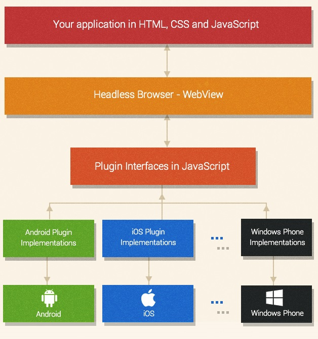

Mobile applications are creeping in everywhere, starting with smartphones and tablets, to smart watches, and soon be found in other wearables, too. However, developing for each separate mobile platform can be an exhaustive task, especially if your resources are limited, or if you are a single developer. This is where becoming a well-versed Apache Cordova developer can come in handy by providing a way to develop mobile applications using standard web technologies - HTML5, CSS3 and JavaScript.

In 2009, a startup called Nitobi created PhoneGap, an open source API for accessing native mobile resources, with the goal of enabling developers to create mobile applications using standard web technologies. In Nitobi’s vision, most mobile applications would soon be developed using PhoneGap, but developers would still have the option of writing native code when necessary, be it due to performance issues, or lack of a method of accessing specific hardware.

Adobe acquired Nitobi in 2011. However, the open source core was donated to the Apache Software Foundation and rebranded under the name Cordova. A common analogy you will often run into is that Cordova is to PhoneGap what WebKit is to Chrome or Safari. Obviously, the differences between Cordova and PhoneGap were minimal in the beginning. With time, Adobe developed its own set of proprietary features, while Cordova was (and still is) supported by the open source community. This Apache Cordova review and tutorial will examine Cordova app development in more detail.

#### Apache Cordova Capabilities

In essence, Cordova has no limitations in relation to natively developed applications. What you get with Cordova is simply a JavaScript API, which serves as a wrapper for native code and is consistent across devices. You can consider Cordova to be an application container with a web view, which covers the entire screen of the device. The web view used by Cordova is the same web view used by the native operating system. On iOS, this is the Objective-C UIWebView class; on Android, this is android.webkit.WebView.

Apache Cordova comes with a set of pre-developed plugins which provide access to the device’s camera, GPS, file system etc. As mobile devices evolve, adding support for additional hardware is simply a matter of developing new plugins.

Finally, Cordova applications install just like native applications. This means that building your code for iOS will produce an IPA file, for Android an APK file, and building for Windows Phone produces an XAP file. If you put enough effort into the development process, your users might not even realize that they are not using a native application

#### Apache Cordova Development Workflows

There are two basic paths you can follow when developing with Cordova:

When your intention is to deploy an application to as many platforms as possible, with little or no platform-specific development, you should use the cross-platform workflow. The main tool supporting this workflow is the Cordova Comand-Line Interface (CLI), which serves as a higher level abstraction for configuring and building your application for different platforms. This is the more commonly used development path.
If you plan to develop your application with a specific platform in mind, you should use the platform-centered workflow. This way, you will be able to tweak and modify your code at a lower level by mixing native components with Cordova components. Even though you could use this approach for cross-platform development, the process will be longer and more tedious.
It is usually recommended to start with the cross-platform development workflow since switching to platform-centered development is fairly straightforward. However, if you initially start with the platform-centered workflow, you will not be able to switch to cross-platform development since the CLI will overwrite your customizations once you run the build process.

To install Cordova visit https://cordova.apache.org/

