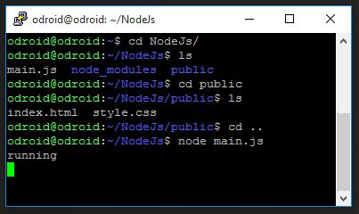
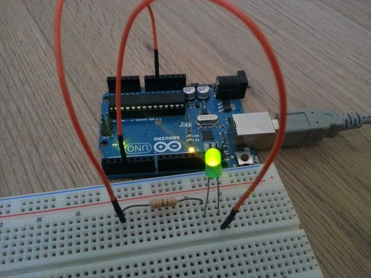

in this instructable, I'll show you how to create a lightweight and incredibly responsive web server with WebSockets.

I'll use it to control a LED using an Arduino but the concept can be applied to many other projects.

Since this project does not use any on-board peripherals, it will work with just about any computer, but running it on a low power machine like the Raspberry PI makes sense for continuous operation.

Why use Node.Js or WebSockets?
There are a few tutorials on the web that show how to use a Raspberry Pi for home automation, but many use php and simple http requests to send data back to the server. This is fine for simply switching on and off some lights but quickly reaches it's limitations when you want to run code server-side or if you want bidirectional communication.

Node.Js allows you to write programs in JavaScript and the vast amount of community-made libraries enables you to write very intricate programs in just a few lines of code.

Websockets have a few advantages over simple http requests:

Speed: A normal http request has to establish a connection before any transactions can happen which takes a lot of time. A websocket is always open and ready to send or receive data.
This means that the lag can be as low as your ping, so just a millisecond or two in most cases
Bidirectional: Websockets allow data to be sent in both directions, this also means that the server can trigger events in the client.

#### Step 1: Setting up the environment

Intall Node.js in PI with directions at http://blog.wia.io/installing-node-js-v4-0-0-on-a-raspberry-pi?utm_source=nodeweekly&utm_medium=email

		wget https://nodejs.org/dist/v4.0.0/node-v4.0.0-linux-armv7l.tar.gz
		tar -xvf node-v4.0.0-linux-armv7l.tar.gz
		cd node-v4.0.0-linux-armv7l
		sudo cp -R * /usr/local
		
#### Creating your project
		mkdir ~/node_led
		cd ~/node_led
		mkdir public		
		
#### Installing libraries

        npm install express
		npm install socket.io
		npm install serialport		
		
Be sure to do this is the node_led folder or use the '-g' flag to install the libraries globally.

#### Node Server Script 

        var express = require('express');
		app = express();
		server = require('http').createServer(app);
		io = require('socket.io').listen(server);

		var SerialPort = require("serialport").SerialPort
		var serialPort = new SerialPort("/dev/ttyACM0", { baudrate: 115200 });

		server.listen(8080);
		app.use(express.static('public'));		

		var brightness = 0;

		io.sockets.on('connection', function (socket) {
			socket.on('led', function (data) {
				brightness = data.value;
				
				var buf = new Buffer(1);
				buf.writeUInt8(brightness, 0);
				serialPort.write(buf);
				
				io.sockets.emit('led', {value: brightness});	
			});
			
			socket.emit('led', {value: brightness});
		});

		console.log("running");		
		
		
		
#### HTML file code

       <!DOCTYPE HTML PUBLIC "-//W3C//DTD HTML 4.01//EN" "http://www.w3.org/TR/html4/strict.dtd">
		<html>
		  <head>
			<title>LED Controller</title>
			<meta name="viewport" content="width=400px" />
			
			
			<link rel="stylesheet" href="style.css">
		  </head>
		  <body>
			<input type="range" id= "inputSlider" min="0" max="255" value="50" step="1" oninput="showValue(this.value)" />
			
			  50
			
			
		  </body>
		</html>	

Run nodejs main.js		